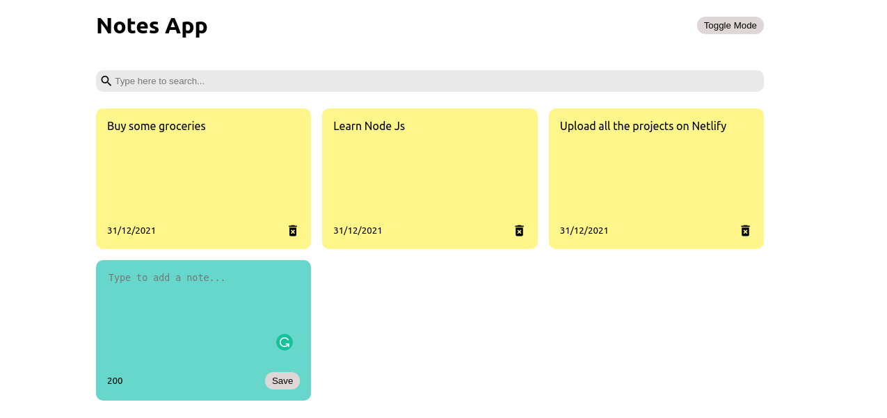

 
  

<h1 align="center"> Notes App </h1>
<h5 align="center"><a href="https://notes-app-react-bymayur.netlify.app/">Click here to see Live on netlify</a></h5>
<h5 align="center"> React JS Mini Project - 1 - <a href="https://www.newtonschool.co/">Newton School</a> (Batch May)

<!-- TABLE OF CONTENTS -->
<h2 id="table-of-contents"> :book: Table of Contents</h2>

  
Table of Contents

  <ol>
    <li><a href="#about-the-project"> ➤ About The Project</a></li>
    <li><a href="#overview"> ➤ Overview</a></li>
    <li><a href="#getting-started"> ➤ Getting Started</a></li>
    <li><a href="#references"> ➤ References</a></li>
    <li><a href="#credits"> ➤ Credits</a></li>
  </ol>

<!-- ABOUT THE PROJECT -->
<h2 id="about-the-project"> :pencil: About The Project</h2>

 
  Notes app is a simple note making app which can be used to save the important tasks. It is kind of similar to a todo-list.

<!-- OVERVIEW -->
<h2 id="overview"> :cloud: Overview</h2>

 
  This project is based on React Js where states are used to manage the user notes. This app also let user store the data on their local storage.

<!-- GETTING STARTED -->
<h2 id="getting-started"> :book: Getting Started</h2>

Download the project files and open the project folder:

Run npm install to install all the dependencies.

Run npm start to start the application.

<!-- About Me -->
<h2 id="credits"> :scroll: Credits</h2>

Mayur Bahugna

I am an Indian Freelance Software Developer based in India <a href="http://complexfoundation.com">Checkout my Portfolio for more Cool Projects.</a>

